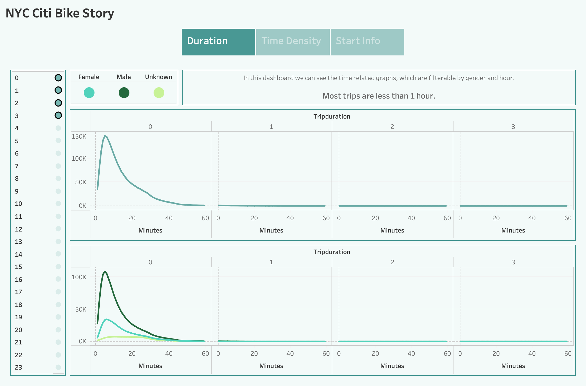

# NY Citibike with Tableau

***University of Toronto - Data Analytics Boot Camp - Module 15 - NY Citibike with Tableau***

---

## Overview

In order to have a good understanding of different aspect of a bike sharing startup, we have investigated Citi Bike data for New York for August 2019.
This investigation has been conducted to provide an investor with some information about the business to enable him to make a data-driven decision.

---

## Results

we can see 7 different graphs, organized in 3 different dashboard and integrated in one Story. I will explain each story (containing all 7 graphs) here.

### Dashboard 1: Duration Dashboard

In this dashboard we can see the time related graphs.
The upper graph shows the number of rides considering their duration (Hours and minutes).
The lower graph shows the number of rides considering their duration (Hours and minutes), breakdown by gender.

***Filters***
* Duration (Hour) - Both Charts
* Gender - Just lower chart

***Insight***
  * Most trips are less than 1 hour.
  * Men has a higher share in rides but the duration pattern is the same for men and women.

---

### Dashboard 2: Time Density Dashboard

In this dashboard we can see the density related graphs.
The left graph shows the density of rides breakdown by hours and weekdays.
The right graph illustrate the density of rides breakdown by hours, weekdays, and gender.

***Insight***
  * Most demands were during working days (Mon-Fri) at morning (6-10AM) and Evening (5-8PM).
  * Men and women followed the same pattern of using Citi Bike considering he day and hour.
