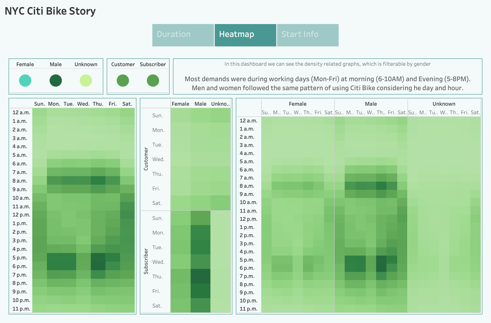

# NY Citibike with Tableau

***University of Toronto - Data Analytics Boot Camp - Module 15 - NY Citibike with Tableau***

---

[Link to Story](https://public.tableau.com/app/profile/emad.soheili/viz/CitiBike-Aug2019/NYCCitiBikeStory?publish=yes)

---

## Overview

In order to have a good understanding of different aspect of a bike sharing startup, we have investigated Citi Bike data for New York for August 2019.
This investigation has been conducted to provide an investor with some information about the business to enable him to make a data-driven decision.

---

## Results

we can see 7 different graphs, organized in 3 different dashboard and integrated in one Story. I will explain each story (containing all 7 graphs) here.

### Dashboard 1: Duration Dashboard

In this dashboard we can see the time related graphs.
The upper graph shows the number of rides considering their duration (Hours and minutes).
The lower graph shows the number of rides considering their duration (Hours and minutes), breakdown by gender.

***Filters***
* Duration (Hour) - Both Charts
* Gender - Just lower chart

***Insight***
  * Most trips are less than 1 hour.
  * Men has a higher share in rides but the duration pattern is the same for men and women.

---

### Dashboard 2: Time Density Dashboard

In this dashboard we can see the density related graphs.
The left graph shows the density of rides breakdown by hours and weekdays.
The right graph illustrate the density of rides breakdown by hours, weekdays, and gender.

***Insight***
  * Most demands were during working days (Mon-Fri) at morning (6-10AM) and Evening (5-8PM).
  * Men and women followed the same pattern of using Citi Bike considering he day and hour.

---

### Dashboard 3: Start Information Dashboard

In this dashboard we can see the Information about trips' start.
The left graph shows the number of trips against starting hours.
The right chart is illustrating the location of starting station of trips and their relative amount (by color and size).

***Filters***
* Starting Hour - Just right chart
* Gender - Both Charts

***Insight***
  * Overall peak time is 7-10AM and 5-7PM.

---

## Summary

***Summary of steps***
   1. Load csv file in pandas DataFrame.
   2. Change the duration from seconds to datetime format.
   3. Export a new csv file.
   4. Load the new csv file in Tableau.
   5. Creat an extract to avoid using a live data connection.
   6. Creat 7 different graphs.
   7. Creat 3 different filters (Duration (Hour), Start Time (Hour), and Gender)
   8. Creat 3 different dashboards using the graphs and filtes.
   9. Creat an integrated story.
   10. Compelte the Readme file using Markdown.

---

***Suggestion for future vizualization***
   1. Create a Dashboard showing major (e.g. stations with more than 10000 trips) starting and end stations side by side.
   2. Creat visualizations to see the effect of subscription on number and duraton of trips.
